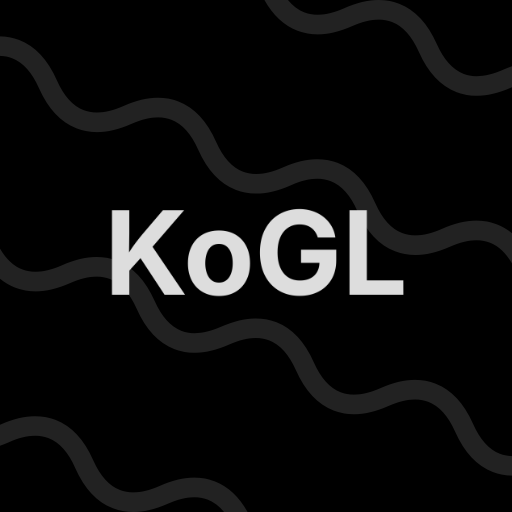

 
 <h1>KoGL (Kolpa Graphics Library)</h1>

 a backend-agnostic cross-platform lightweight graphics framework for C#.

 
 <!-- 
  -->
 
 

this was heavily inspired by libraries such as [RGL](https://github.com/ColleagueRiley/RGL) and [RLGL](https://github.com/raysan5/raylib/blob/master/src/rlgl.h), and is especially suitable for prototyping, tools, graphical applications, and education.

> WARNING:
> **status:** API is subject to change.

this stills a work in progress, if you want to contribute or report any issue, feel free for open a pull request.

this is currently a port of my library I made in pure C to C#, so:

- maybe at some point I'll reset all the commits in the repository, cause there are some pretty disorganized messages.
- I'm thinking of changing the name to kgdx or kgfx to keep the old kogl-c public.

## Features

- OpenGL immediate-mode style but with modern systems behind the scenes.
- agnostic backend architecture
- simple and easy to use.

### License

This project is licensed under the unmodified zlib/libpng license. See [LICENSE](LICENSE.txt) for details.

This project uses third-party libraries via NuGet packages and project configuration files, including [Silk.NET](https://github.com/dotnet/Silk.NET), [StbImageSharp](https://github.com/StbSharp/StbImageSharp), and others for windowing, graphics, input, and file format support. Check the dependencies licenses in the project documentation for more information.
